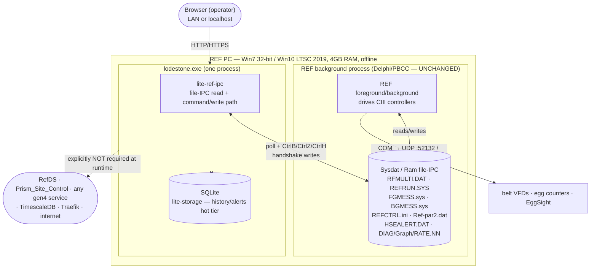
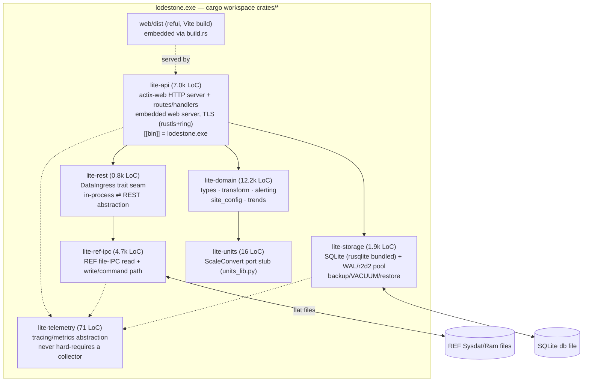

# Lodestone — Technical Analysis

*Repository:* `/home/murphy/vcs/lodestone`
*Analyzed:* 2026-07-06 · HEAD `747147a`
*Authors:* `sryan <sryan@pmsi.cc>` (31 commits) · `bherbruck <brennen.herbruck@gmail.com>` (81 commits)
*Build window:* 2026-07-02 07:09 → 2026-07-06 14:25 (≈4.5 days)

---

## 1. Executive summary

Lodestone is a **standalone, single-`.exe` "lite" bridge** that runs directly on a
legacy REF PC (Windows 7 32-bit / Windows 10 LTSC 2019 64-bit, **4 GB RAM,
offline**) *alongside* an already-operating REF background process, giving
operators a modern web UI + REST API **without** any of the gen4 `full` stack — no
K3s, no TimescaleDB, no Traefik, no Docker, no RefDS, no Prism_Site_Control, no
internet. It does this by **reading and writing the REF's own on-disk file-IPC
contract directly** (`RFMULTI.DAT`, `REFRUN.SYS`, `FGMESS.sys`, `REFCTRL.ini`,
`Ref-par2.dat`, …), collapsing the two Delphi hops (`RefDS` HTTP/WebSocket +
`Prism_Site_Control`'s file coordinator) into one in-process Rust binary. The API
and domain logic are **lifted, largely verbatim, from `gen4-backend-api`**
(actix-web 4.12.1, proven to build/run on Win7 at Rust 1.77.2); the frontend is
`refui`, Vite-built and embedded in the exe; a local **SQLite** file replaces the
shared Postgres/Timescale history store. It is explicitly framed as a **bridge,
not a replacement**, with a stated long-term goal of converging `full` and `lite`
into one codebase over a `DataIngress` trait seam. Built in ~4.5 days by Sean
(manager) and Brennen (external contractor); the entire multi-repo dependency
graph — including 161 MB of real customer REF-PC deployment data — is vendored
in-repo under `Copied/`.

---

## 2. Architecture

### 2.1 System context — Lodestone beside the legacy REF PC

Lodestone never touches the network to reach REF data. Its only external edge is
the shared filesystem the REF process already uses; the two Delphi transports
(`RefDS` `:9070` HTTP/XData + WebSocket relay, `Prism_Site_Control`'s ZeroMQ
plugin fabric) are **collapsed away** — that inter-process hop only existed
because one Delphi component was network-facing and one was on-site. In a single
process, `lite-api` calls `lite-ref-ipc` in-process.

### 2.2 Component diagram — the crate workspace

### 2.3 End-to-end data flow

1. **Read.** `lite-ref-ipc` (`source.rs`, `refrun.rs`, `rfmulti.rs`, `rate.rs`,
   `archive.rs`) polls the REF's flat files, byte-exact-decodes the packed Delphi
   records (`REFRUN.SYS` = `14+6+48+1800+84+20·108+10·3412 = 38232` bytes,
   validated against `Copied/Example_Refs/GMO_Live_1`), and emits DTOs behind the
   `DataIngress` trait in `lite-rest`.
2. **Transform.** `lite-domain` (lifted from gen4) reduces raw samples to
   control-relevant state (conveyor inventory, totals, trends, alert events) —
   "reduce at the front," per CLAUDE.md's control-space doctrine.
3. **Serve.** `lite-api` (actix) exposes the gen4-compatible REST surface
   (`GET/PUT /api/v1/config`, `/site/data`, `/site/data/history`, `/metrics`, …)
   and serves the embedded refui SPA same-origin.
4. **Persist.** `lite-storage` writes reduced snapshots + typed rate diagnostics
   to SQLite (hot tier), with a 14-day `VACUUM INTO`+gzip backup/restore cycle
   keyed to REF's own ~30-day rolling on-disk archive. SQLite is history/alerts
   only — live truth stays the REF files.
5. **Write/command.** A `PUT /api/v1/config` fans out to REF file-IPC commands
   (`updatefgmsg`/`beltspeed`/`setnewoptimal`/`updateHSEAlerts`/`startrun`/
   `endrun`) through `lite-ref-ipc`'s `command.rs`+`handshake.rs` (the CtrlB
   editor-lock / CtrlZ belt-toggle / CtrlH alert handshake).

---

## 3. Reused vs rebuilt vs new

The workspace is ≈27.7k lines of Rust across seven `lite-*` crates. Two of them
(`lite-domain`, `lite-api`, ≈19.2k lines) are **lifted from
`gen4-backend-api@eebbaf0a`**; the rest is genuinely new.

| Crate / area | LoC | Origin | Reuse classification |
|---|---:|---|---|
| **lite-domain** | 12,211 | `gen4-backend-api/src/{types,transform,services/alerting,site_config}` | **Modified copy** — lifted verbatim/near-verbatim; edition-2021 / MSRV-1.77.2 downgrade (edition-2024 `let`-chains rewritten to nested `if let`); infra imports stripped. Delta captured as `git apply`-able patches in `patches/gen4/`. |
| **lite-api** | 7,043 | `gen4-backend-api/src/api/{handlers,routes}` + `config`, `services` | **Modified copy** — actix handlers/routes lifted; DB/OTLP/ingress infra removed; config request/response shape deliberately thinned (see `crates/lite-api/DIVERGENCE.md`); `[[bin]]` renamed to `lodestone.exe`. Some handlers still byte-identical to source. |
| **lite-rest** | 765 | new (concept modeled on gen4's ingress trait) | **New** — the `DataIngress` in-process⇄REST seam ("avoid internal REST" from Goal.txt); lite binds in-process, `full` could bind REST over the same trait. |
| **lite-ref-ipc** | 4,694 | Delphi `TRefProtocolCoordinator` + `LegacyFileFormats/*` (study-only) | **Genuinely new** — Rust port of the REF file-IPC read+write path. No gen4 equivalent (this logic lives only in Delphi). 13 modules: `refrun`, `rfmulti`, `rate`, `archive`, `fgmess`, `handshake`, `command`, `hsealert`, `ini`, `legal`, `reader`, `source`, `lib`. |
| **lite-storage** | 1,902 | new (gen4 uses Postgres/Timescale) | **Genuinely new** — SQLite hot tier (rusqlite bundled, pinned 0.37 for 1.77.2), WAL + r2d2 pool, typed rate-diag table, gzip snapshots, backup/VACUUM/restore. Replaces gen4's `services/db` + TimescaleDB entirely. |
| **lite-telemetry** | 71 | abstracted (gen4 uses OTLP everywhere) | **New/thin** — `tracing` now, `/metrics` Prometheus later; no hard OTLP dependency (offline-first). |
| **lite-units** | 16 | `docs/SVNDocs/.../units_lib.py` | **New stub** — `ScaleConvert()` port placeholder; minimal so far. |

**Byte-identical (~7.5k lines):** large stretches of `lite-domain` transform +
alerting and several `lite-api` handlers are byte-for-byte identical to
`Copied/gen4-backend-api` — the team explicitly tracks this because it means gen4
bugs were inherited unchanged (`docs/Known_Issues.md`: "8 of 33 findings inherited
verbatim from gen4… 4 of 4 Security-posture findings are byte-identical").

**Modified copy (~18.7k lines in overlapping files):** the same domain/api files
with MSRV/edition downgrades, infra removal, and deliberate API-shape divergences.
The `patches/gen4/` ledger holds **25 unified diffs** (regenerated in `#22`,
`git apply --check`-clean against the frozen tree) so every change can be
back-ported to the real gen4 repo for eventual convergence.

**Genuinely new:** `lite-ref-ipc` (the whole file-IPC port — the technical heart),
`lite-storage` (SQLite), `lite-rest` (the trait seam), plus the entire Win7 build
pipeline (`scripts/build-win7.sh`, `.cargo/config.toml`: Rust 1.77.2 +
`i686-pc-windows-msvc` + `+crt-static`, cross-built from WSL via `cargo-xwin`),
the SSH-free `vm/` Win7 test harness (serial-port results, CD/ISO exe delivery),
`win7-bench/`, `win7-probe/`, and the `spikes/win7-{web,axum,actix,tls}` framework
probes.

### 3.1 The wholesale-vendored `Copied/` tree

Per `Copied/VENDORED.md` and `MIGRATION_MANIFEST.txt`, `.git`-stripped flat copies
(Goal.txt: *"unattached in a git perspective"* — deliberately not submodules):

| Path | Size | Provenance | Purpose |
|---|---:|---|---|
| `Copied/gen4-backend-api/` | 2.5M | `main @ eebbaf0a3ae5…` (2026-07-02) | **Lift source** for `lite-domain`/`lite-api`; frozen behavioral-diff oracle. |
| `Copied/refui/` | 36M | `main @ 3cc23a2bf81c…` (2026-07-02) | Frontend source → `web/` → Vite → `web/dist/` (embedded). |
| `Copied/core/` | 12M | `main @ 7c42565cfa3a…` (2026-07-02) | Deployment reference only (lite is a single exe; not a port target). |
| `Copied/DelphiXE/` | 65M | SVN/CVS compile-oriented snapshot | **Study-only** wire-protocol/business-logic ground truth: `RefDS`, `Prism_Site_Control`, `Shared/uREFTypes.pas`, `LegacyFileFormats/*` — the models `lite-ref-ipc` was ported from. |
| `Copied/SharedInfo/` | 56M | third-party Delphi libs (mORMot ×4 versions, fastMM, jcl/jvcl, DevExpress, ZEOS…) | Dependency closure so the copied `.dproj` paths resolve; noted mixed-mORMot compile risk. |
| `Copied/Example_Refs/` | **161M** | **real production REF-PC deployment data** — `GMO_Live_1`, `GMO_Bkp_1`, `GMO_Bkp_2`, `GMO_BKP_Old` | Live + backup on-disk snapshots from a single real customer site (**GMO**), used as decoder test fixtures (`tests/fixture_gmo_live.rs`). Real customer data checked into the repo. |

---

## 4. Their planning & documentation

- **`Goal.txt`** (the charter, verbatim source): *"Build a rust exe,
  configuration, sqlite db, and a web subdirectory… serve as a standalone entity
  on win 10 ltsc 2019 64 bit and win7 32bit."* Runs standalone on a REF PC beside
  an operating REF; *"should not need refds, prism_site_control, any gen4 services
  or repos, internet."* One crate per subsystem, DRY, low coupling/high cohesion.
  *"ideally be able to become a single codebase to operate this reduced
  configuration and the full stack"* → converge as **"full" and "lite"**. Web
  server should be *"a modern scalable and secure rust based web server… as close
  in functionality as possible to something like trafic, nginx, caddy,"*
  encapsulated/swappable — and Sean names his own risk: *"That's going to be the
  biggest push back is a 'roll your own' web server vs a full reverse proxy."*
  *"Avoid internal rest calls, this is inprocess and fast"* (→ `lite-rest` trait
  seam). *"reduce latency, since the files have a defined latency, all stack
  latency is additive."*

- **`README.md`** (52 KB): full system map — the legacy Delphi chain
  (`gen4-backend-api → :9070 RefDS → WebSocket → Prism_Site_Control/RefPlugin →
  file IPC → REF`), the proposed target crate architecture, the CIII wire
  protocol/timing (ports 52132/52134, DLE/STX framing, variable IDs 469–473,
  connector→uniface→cache-block→controller mapping), and the business case for the
  bridge. Correctly sourced against the gen4-stack workspace docs (cited to commit
  `8623826`, 2026-07-01).

- **`CLAUDE.md`** (25 KB): opens with *"This is CONTROL space — act like it"* —
  reduce-at-the-front doctrine (aggregate once at ingest, drop raw, no
  derive-at-read) to avoid 4 GB OOM and nondeterministic reductions. Restates
  Goal.txt constraints; mandates cargo-managed workspace and per-crate divergence
  docs.

- **`HANDOFF.md`**: 2-minute orientation for a fresh session; crystallizes the
  **PORT / COLLAPSES / STUDY** distinction — *port* Prism_Site_Control's file
  coordinator into `lite-ref-ipc`; *collapse* RefDS's `:9070` HTTP+WebSocket
  network role; *study* RefDS's data model. States the convergence plan: **lift
  the API+domain out of gen4** and slot `lite-ref-ipc` into the **`DataIngress`
  seam**. Flags the open command-completion (write-ack) semantics as highest-risk.

- **`docs/Leadership.md`**: business framing for management — side-by-side "full =
  2 machines / ~10 infra services / real ops overhead" vs "lite = 1 machine / 0
  new infra / deploy is *copy one file*." Verifies (from `core`) that `full`'s
  provisioning only stands up **Linux** VMs, so a site today means Linux infra
  *plus* the existing Windows REF PC — two boxes. Notes the 4 GB-vs-32 GB hardware
  gap and elevated RAM prices. Frames lite as *"the fastest path to more customers
  running something gen4-branded, and the place we ship new chargeable features"*
  without asking a customer to adopt `full`.

- **`MIGRATION_MANIFEST.txt`** (428 KB): the exact per-file vendoring ledger —
  what was copied, individually resolved, left ambiguous (notably four different
  mORMot version dirs), or left unresolved when assembling the `Copied/` tree.

- **`Repos.txt`**: flat dependency list — the three cloned gen4 repos
  (`refui`, `gen4-backend-api`, `core`), the Delphi `Copied\…` paths, live auth
  repos (auth-server/lib/discovery, with the SP6 auth-api decommission noted), and
  the VB6 REF client (`software/visualbasic6.git` — clone, not vendored).

**Stated convergence roadmap:** "Correctness first, convergence second — but both
are real goals." Bridge ships now; the intended second step is `gen4-backend-api`
adopting a `lite-*` crate internally, made attractive by building each crate DRY
and correct enough against the real system that adoption is the *obviously easier*
choice than maintaining two divergent backends. The `DataIngress` trait in
`lite-rest` is the designed seam: `lite` binds it in-process; `full` could bind it
to REST.

---

## 5. Technical decisions the Gen4 team was previously denied

Lodestone quietly ships three architectural moves the Gen4 team had proposed and
been overruled on. Because it is framed as a throwaway "bridge experiment" by a
manager + external contractor, it sidestepped that governance.

### 5.1 Eliminating the DataServer/RMM (Mark's Delphi `:9070`) dependency

The entire premise. `gen4-backend-api` *must* poll `RefDS` (`:9070`, "Mark's
DataServer") every cycle for live REF data. Lodestone reads the REF flat files
**directly** and deletes that dependency. From `HANDOFF.md`:

> **COLLAPSES (do not reproduce):** RefDS's *network role* — its `:9070`
> HTTP/XData API and WebSocket command-relay. RefDS never touches the files… In
> the single-process `lite` binary that hop vanishes: `lite-api` calls
> `lite-ref-ipc` in-process.

`lite-ref-ipc` reimplements Prism_Site_Control's `TRefProtocolCoordinator` +
`LegacyFileFormats/{RefRunFile,FGMessFile,BGMessFile,RateDiagFile}.pas` in Rust —
byte-exact-validated against the real GMO fixture. This is exactly the
"read/write REF's files ourselves instead of depending on Mark's stack" that the
gen4 team's external-dependency posture had kept off-limits (the whole `full`
stack is architected *around* RefDS as the sanctioned REF data source).

### 5.2 Standalone single-binary deployment without Kubernetes

`full` deploys only via `core`'s GitOps chain (Terraform → Ansible → K3s → Helm →
ArgoCD, ~10 services). Lodestone is *one exe*. `docs/Leadership.md`:

> `full`'s complexity is the right long-term investment as gen4 grows. It is not
> what gets a customer onto gen4 *this year*, on the hardware they already paid
> for. … Deploy is "copy one file."

The embedded actix web server (proven on Win7) *is* the "roll your own web server
vs. a full reverse proxy" bet Goal.txt names as the expected pushback — kept
encapsulated/swappable precisely so the objection stays cheap to reverse.

### 5.3 Local SQLite storage instead of shared TimescaleDB

`full` mandates the shared `gen4db` TimescaleDB. `lite-storage` is a local SQLite
file with its own backup/VACUUM/restore. `docs/Schema.md` reproduces the DDL
verbatim; CLAUDE.md's control-space doctrine justifies the reduced model
(*"reduce at the front… store only the reduced state… drop raw"*) as the only
model that fits a 4 GB box — an explicit rejection of the relational/web-CRUD
reflex the `full` stack encodes. The 14-day backup cadence is deliberately keyed
to REF's own ~30-day file window so the two together are always a gapless recovery
source (`README.md` "Durability").

---

## 6. Gaps and risks

- **No authentication.** `docs/Security.md`: *"No auth at the app layer (refui
  sends `Bearer no-auth`)."* The entire gen4 offline-first auth apparatus
  (auth-server signed manifests, capability bitmaps, ForwardAuth `/verify`,
  `/check`) is **absent**. Standalone mode is backstopped only by OT-network
  isolation; built-in optional auth is roadmap (#14), not built. Binds
  `0.0.0.0:8080` by default — on a flat/dual-homed network the CORS
  (`allow_any_origin`) + no-auth exposure goes live.
- **Inherited gen4 defects.** `docs/Known_Issues.md` catalogs findings that are
  **byte-identical to gen4** (write-then-validate config corruption, unserialized
  concurrent PUTs on a shared temp file, nondeterministic HashMap-ordered group
  averages, positional house/alert pairing). Some fixed lite-side; the gen4
  back-port stays open — so the hard fork now carries *divergent* fixes.
- **Single-site, single-REF.** One box fronts one REF; site-config materialization
  is deliberately bounded to a small `(machine, ref_version)` key set (#11). No
  multi-site/fleet story — that's `full`'s job.
- **Telemetry is a 71-line stub.** OTel-shaped but abstracted; no collector, no
  Grafana/LGTM. Visibility relative to `full`'s OTLP-everywhere is minimal.
- **Write/command path partially unproven.** `crates/lite-ref-ipc/DIVERGENCE.md`:
  the CtrlB/CtrlZ handshake state machine is validated against a **mock BG, not a
  live REF**; belt-speed ack-wait not live-validated. This is the physical-machinery
  path (belts, egg counters) — highest risk, least documented.
- **Hard-fork maintenance cost.** ~19k lines are copied gen4; the `patches/gen4/`
  ledger (25 diffs) is the *only* thing keeping the fork back-portable, and it has
  already drifted once (`#22`: 11 of 21 patches stale, 2 missing, a naming
  collision). Every gen4 change upstream must be manually reconciled. The
  convergence goal is real but unproven — nothing in `full` has adopted a lite
  crate yet.
- **Customer production data in-repo.** 161 MB of a real customer's
  (**GMO**) live + backup REF-PC directories (`Copied/Example_Refs/`) are committed
  to git — real operational data, not synthetic fixtures.
- **Personal-email authorship.** All 112 commits are authored under Gmail
  addresses (`brennen.herbruck@gmail.com`, and `sryan@pmsi.cc` for Sean); the
  external contractor's work — including the whole file-IPC port against vendored
  Delphi IP and customer data — lands under a personal identity.

---

## 7. Commit timeline (2026-07-02 → 07-06)

| Day | sryan | bherbruck | What happened |
|---|---:|---:|---|
| **07-02** | 21 | 36 | **Scaffolding + the Win7 proof.** Sean seeds the repo: `e47049a` initial commit, `Goal.txt`, `CLAUDE.md`, `Repos.txt`, README reframes ("bridge, not replacement"), `docs/Leadership.md` with ASCII diagrams, and `Copied/{DelphiXE,SharedInfo,Example_Refs}` + `deed95a` "Add vendored repos" (gen4-backend-api/refui/core, `VENDORED.md`). Brennen bootstraps the Rust workspace (`da81f35`), **proves refui + a lifted gen4 piece run on real Win7 32-bit** (`e86b41b`), **lifts the whole gen4 backend into `crates/` building on Win7 1.77.2** (`7e6d923`), serves embedded refui + API from one exe (`9a7fbf1`), wires SQLite (`1a2f6a9`), TLS via rustls+ring (`f8e20fd`/`09c55b2`), and starts the file-IPC read path. |
| **07-03** | 2 | 12 | **REF IPC read+write depth.** Brennen decodes DIAG/Graph/RATE.NN rate diagnostics (`b168e80`), builds the `RefCommandSink` write seam + all six commands (`5ec1f59`, `ac1c326`), the startrun/endrun RefRun.sys writer, mock-background handshake validation (`9b59e8d`), unified `GET/PUT /api/v1/config` (`c2759eb`), and build.rs that builds+embeds refui. |
| **07-04** | 6 | 14 | **Parity audit + hardening.** The `full`-vs-lite RefDS-parity audit (`ba3152c`, 43 findings) drives two fix batches; REST full-topology abstraction (`2b527ff`); read-only-by-default writes (`2732dac`); Fable's review fixes (`8d8c7da`, 18 findings); the ChickenTime timezone-reconciliation doc; and `#22` regenerating the divergence ledger. |
| **07-05** | 2 | 14 | **Storage redesign + robustness.** Typed hot-tier storage (`f0d8051`/`5811b3d` — typed points, no JSON blobs/rollups), WAL+r2d2 pool replacing the single Mutex (`7afc624`), SQLite backup/VACUUM/restore (`fe0e3db`), fuzzing for the IPC decoders (`37b8de8`, `0f0d8c2`), and a batch of GitLab-issue fixes (#35/#37/#21/#31, HouseTransformer panic #44/#45). |
| **07-06** | 0 | 5 | **Deployment polish.** `lodestone.toml` typed config + discovery, `scripts/build-win7.sh` self-bootstrapping i686 cross-build into `bin/win7/`, ship the artifact as **`lodestone.exe`** (`e2348f6`), VM `start` serving the GMO fixture, and loud startup wiring (REF-dir probe, stub WARN, config-loader notices) — `747147a`, HEAD. |

**Division of labor:** Sean (manager) front-loaded the charter, vendoring, and
business/leadership framing (mostly 07-02); Brennen (contractor) did essentially
all the Rust engineering across all five days — the gen4 lift, the file-IPC
port, storage, and the Win7 pipeline.

---

*Sources: `Goal.txt`, `README.md`, `HANDOFF.md`, `CLAUDE.md`, `Copied/VENDORED.md`,
`docs/Leadership.md`, `docs/Security.md`, `docs/Known_Issues.md`,
`patches/README.md`, `crates/lite-api/DIVERGENCE.md`,
`crates/lite-ref-ipc/DIVERGENCE.md`, `Cargo.toml`, per-crate `Cargo.toml` +
`wc -l`, and `git log --all` forensics.*
